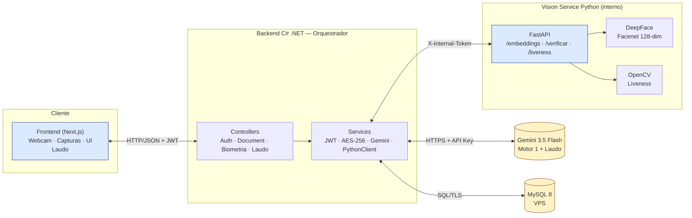
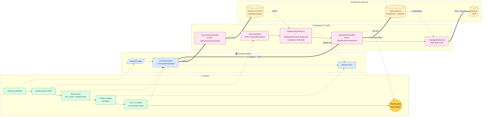
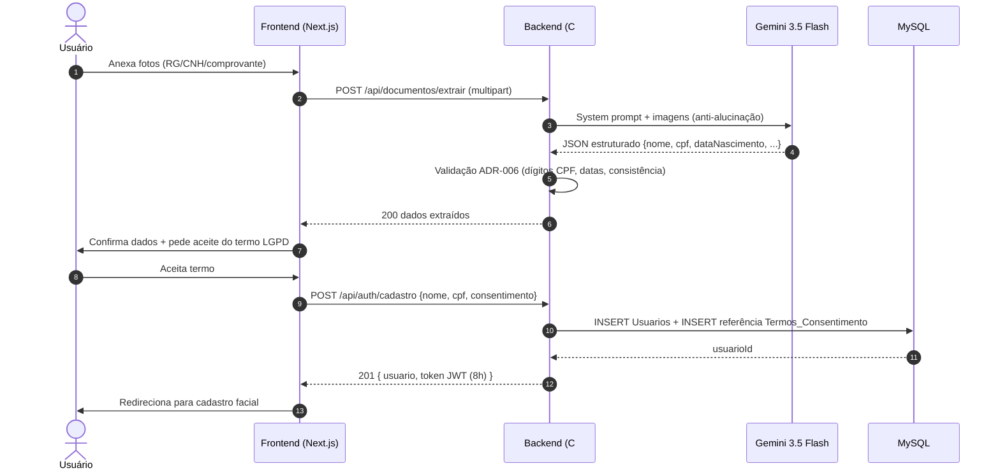
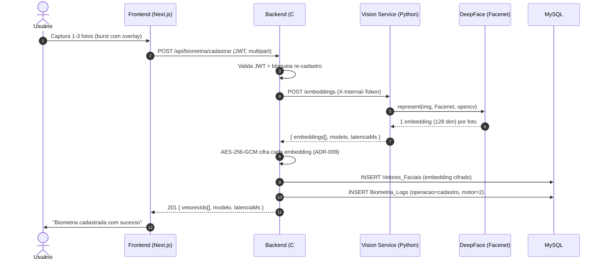
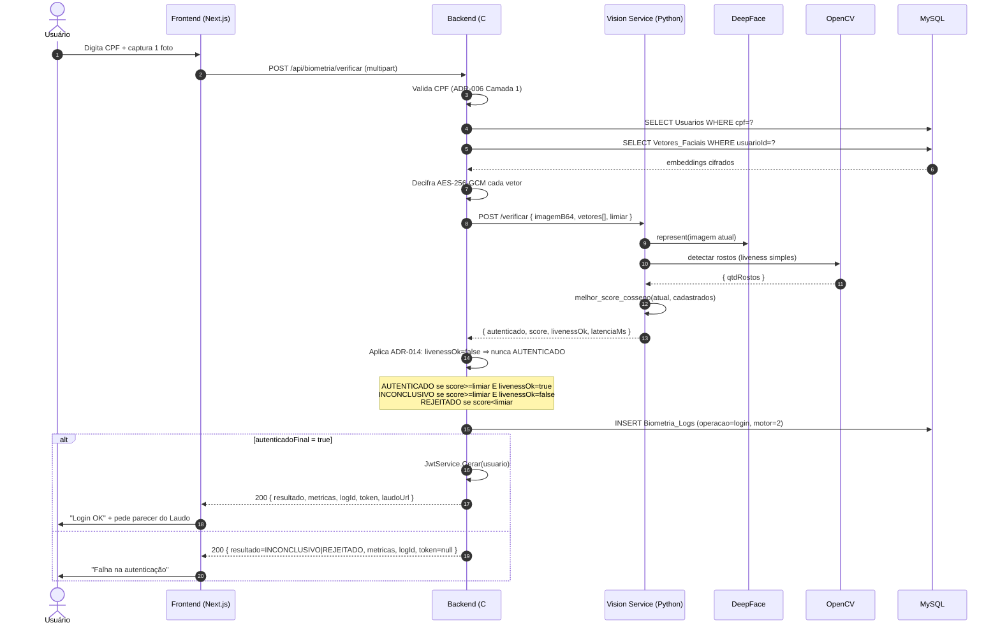
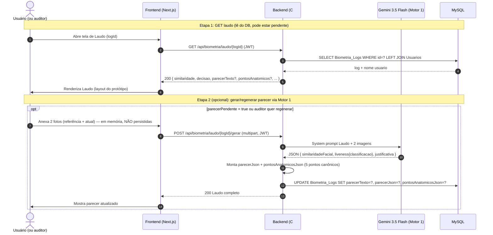
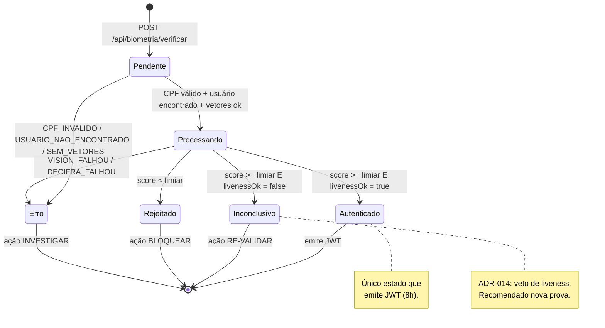
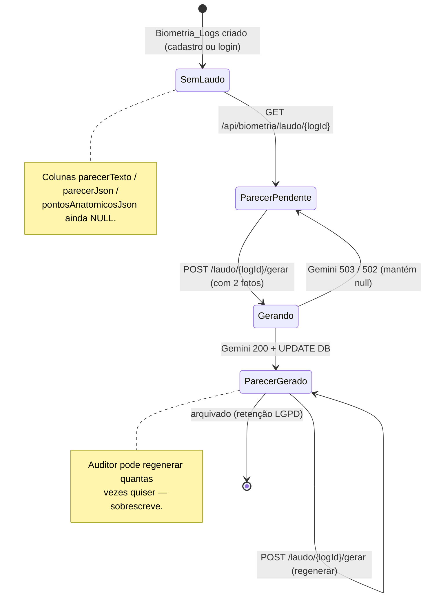

# Arquitetura

Visão de alto nível dos componentes e dos fluxos de cadastro e login. Para decisões de _por quê_, veja [decisoes.md](./decisoes.md). Para detalhes de endpoints, [api.md](./api.md).

## Componentes



## Responsabilidades por serviço

### Frontend (Next.js)
- UI de cadastro e login, com seletor de motor facial.
- Acesso à webcam com overlays visuais (guia de rosto, _burst_ de capturas).
- Captura de fotos de documentos e envio ao backend.
- Apresentação de métricas (latência/acurácia) pós-operação.
- **Não** chama IA nem o vision-service diretamente; passa sempre pelo backend.

### Backend (C# .NET)
- Orquestrador central: regras de negócio, persistência, métricas.
- **Camada de serviços** ([backend/Services](../backend/Services)):
  - `CriptografiaService` — AES-256-GCM para vetores faciais em repouso (ADR-009).
  - `JwtService` — emissão de tokens HS256 para autenticação.
  - `ValidacaoCpfService` — Camada 1 do ADR-006 (dígitos verificadores).
  - `GeminiService` — extração de documentos (ADR-001, ADR-005).
  - `Motor1GeminiService` — Motor 1 (DEMO comparativa + explicador do Laudo ADR-014).
  - `PythonVisionService` — cliente HTTP para o vision-service (Motor 2).
- **Camada de controllers** ([backend/Controllers](../backend/Controllers)):
  - `AuthController` — `/api/auth/cadastro`, `/api/auth/me`.
  - `DocumentController` — `/api/documentos/extrair`.
  - `BiometriaController` — cadastro/verificação/listagem/remoção de vetores + DEMO do Motor 1.
  - `LaudoController` — Laudo Técnico Biométrico (ADR-014).
- Validação determinística dos dados extraídos (ver ADR-006).

### Vision Service (Python / FastAPI)
- Geração de embeddings com `DeepFace` (modelo padrão: Facenet, 128 dim).
- Comparação de embeddings (cosseno) e threshold.
- Liveness caseiro com OpenCV (detecção de rostos + movimento entre frames).
- Suporte a toggle CPU vs GPU (CUDA). **No Windows, roda em CPU** (limitação do TF ≥ 2.11 — ver ADR-013).

### Banco de Dados
- `Usuarios`: dados cadastrais + dados extraídos de documentos.
- `Biometria_Logs`: métricas de cada tentativa (latência, acurácia, motor, acerto/erro) + colunas do Laudo (parecerTexto, parecerJson, pontosAnatomicosJson).
- `Vetores_Faciais`: embeddings (JSON cifrado AES-256-GCM) por usuário.
- `Termos_Consentimento`: termos LGPD versionados.

## Jornada do Usuário (onboarding completo)

Visão de alto nível do caminho que o usuário percorre do cadastro até estar pronto para fazer login facial. Swim lanes (raias) separam o que é ação humana vs automação do sistema.



| Etapa | Quem faz | O que acontece |
|---|---|---|
| 1 | Usuário | Acessa `/cadastro` e lê o termo de consentimento LGPD |
| 2 | Usuário + Backend | Aceita o termo → `POST /api/auth/cadastro` cria usuário e emite JWT |
| 3 | Usuário + Frontend | Anexa 1+ fotos do documento via `DocumentUploader` |
| 4 | Backend + Gemini | `POST /api/documentos/extrair` → Gemini 3.5 Flash extrai dados estruturados |
| 5 | Backend | `ValidacaoDocumentoService` aplica Camada 1 do ADR-006 (dígitos de CPF, datas, consistência) |
| 6 | Usuário | Revê os dados extraídos, corrige se necessário |
| 7 | Usuário + Frontend | Tira 1-3 selfies com overlay facial via `CameraOverlay` |
| 8 | Backend + Vision Service | `POST /api/biometria/cadastrar` → DeepFace gera embeddings (Facenet 128-dim) |
| 9 | Backend | `CriptografiaService` cifra cada embedding com AES-256-GCM antes de gravar |
| 10 | Backend → MySQL | Persiste em `Vetores_Faciais` + registra em `Biometria_Logs` |
| ✓ | Usuário | Está pronto para fazer login facial em `/login` |

## Jornada do Usuário (login facial)

Caminho da autenticação facial, do `/login` até a tela do Laudo Técnico. Cobre os 3 desfechos possíveis (AUTENTICADO, INCONCLUSIVO, REJEITADO) e o veto de liveness (ADR-014).

```mermaid
flowchart LR
    subgraph User["👤 Usuário"]
        U1[Acessa /login] --> U2[Digita CPF]
        U2 --> U3[Captura 1 selfie]
        U3 --> U4{Resultado?}
        U4 -->|autenticado| U5((✅ Acesso<br/>concedido))
        U4 -->|inconclusivo| U6[⚠️ Re-validar<br/>liveness falhou]
        U4 -->|rejeitado| U7[❌ Acesso negado<br/>biometria não confere]
        U6 -.->|tira nova selfie| U3
        U5 --> U8[Abre Laudo Técnico<br/>para auditoria]
    end

    subgraph FE["🖥️ Frontend Next.js"]
        F1[/login page/]
        F2[CameraOverlay<br/>CPF input + captura]
        F3[Tela de resultado<br/>+ Laudo card]
        F1 -.-> F2 -.-> F3
    end

    subgraph BE["⚙️ Backend C# .NET"]
        B1[BiometriaController<br/>POST /api/biometria/verificar]
        B2[ValidacaoCpfService<br/>Camada 1 ADR-006]
        B3[CriptografiaService<br/>decifra AES-256-GCM]
        B4[Regra ADR-014<br/>livenessOk=false<br/>⇒ nunca AUTENTICADO]
        B5[LaudoController<br/>GET /api/biometria/laudo/{logId}]
        B1 --> B2 --> B3 --> B4
        B4 -.-> B5
    end

    subgraph EXT["🌐 Serviços externos"]
        V[(Vision Service<br/>DeepFace + OpenCV)]
        G[(Gemini 3.5 Flash<br/>parecer do Laudo)]
        DB[(MySQL<br/>VPS)]
    end

    %% Fluxo principal
    U1 -.-> F1
    U2 -.-> F2
    U3 -.-> F2
    F2 ==>|multipart + CPF| B1
    B1 --> DB
    DB -.->|vetores cifrados| B3
    B1 ==>|X-Internal-Token| V
    V -.->|score + livenessOk| B4
    B4 -.->|grava Biometria_Logs| DB

    %% Desfechos
    B4 -.->|JWT| U5
    B4 -.->|sem JWT| U6
    B4 -.->|sem JWT| U7

    %% Laudo
    U8 -.-> F3
    F3 ==>|GET laudo| B5
    B5 --> DB
    F3 -.->|POST /gerar| G
    G -.->|parecer textual| B5

    classDef userNode fill:#dcfce7,stroke:#15803d,color:#14532d
    classDef feNode fill:#dbeafe,stroke:#1e3a8a,color:#1e3a8a
    classDef beNode fill:#fce7f3,stroke:#9d174d,color:#831843
    classDef extNode fill:#fef3c7,stroke:#92400e,color:#78350f
    classDef okNode fill:#bbf7d0,stroke:#15803d,color:#14532d,font-weight:bold
    classDef warnNode fill:#fed7aa,stroke:#9a3412,color:#7c2d12,font-weight:bold
    classDef errNode fill:#fecaca,stroke:#991b1b,color:#7f1d1d,font-weight:bold

    class U1,U2,U3,U4,U8 userNode
    class F1,F2,F3 feNode
    class B1,B2,B3,B4,B5 beNode
    class G,V,DB extNode
    class U5 okNode
    class U6 warnNode
    class U7 errNode
```

| Etapa | Quem faz | O que acontece |
|---|---|---|
| 1 | Usuário | Acessa `/login` e digita o CPF |
| 2 | Usuário + Frontend | Captura 1 selfie via `CameraOverlay` |
| 3 | Backend | `ValidacaoCpfService` valida CPF (Camada 1 ADR-006) |
| 4 | Backend + MySQL | Carrega vetores de `Vetores_Faciais` e decifra com AES-256-GCM |
| 5 | Backend + Vision Service | `POST /verificar` → DeepFace gera embedding atual e compara cosseno; OpenCV valida liveness |
| 6 | Backend | Aplica regra ADR-014 (`livenessOk=false` ⇒ nunca `AUTENTICADO`) |
| 7 | Backend → MySQL | Grava métrica em `Biometria_Logs` (operacao=login) |
| 8 | Backend | Emite JWT **só se** `autenticadoFinal = true` |
| 9 | Frontend | Mostra resultado + card com link para o Laudo |
| 10 | Usuário (opcional) | Abre Laudo Técnico para auditoria → `GET /api/biometria/laudo/{logId}` |
| 11 | Usuário (opcional) | Gera parecer via Motor 1 → `POST /laudo/{logId}/gerar` |

**Desfechos possíveis (decisão tripla ADR-014):**

| Cor no diagrama | Resultado | Condição técnica | Ação |
|---|---|---|---|
| 🟢 verde | `AUTENTICADO` | `score >= limiar` E `livenessOk = true` | Emite JWT + libera acesso |
| 🟠 laranja | `INCONCLUSIVO` | `score >= limiar` E `livenessOk = false` | Re-validar (veto de liveness) |
| 🔴 vermelho | `REJEITADO` | `score < limiar` | Bloquear acesso |

## Fluxo de Cadastro (Pré-matrícula)

Cobre a extração de dados do documento + criação do usuário. A biometria facial vem depois (ver próximo fluxo).



## Fluxo de Cadastro Facial (Motor 2 — DeepFace)

Gera os embeddings que servirão de referência para o login. Cifra com AES-256-GCM antes de persistir (ADR-009).



## Fluxo de Login Facial (Motor 2 — DeepFace)

Pipeline de verificação com a regra crítica do ADR-014: `livenessOk=false` ⇒ nunca `AUTENTICADO`, mesmo com score alto.



## Fluxo do Laudo Técnico (ADR-014)

Laudo híbrido: Motor 2 fornece o número; Motor 1 (Gemini) fornece o texto. Gerado sob demanda, depois da verificação.



## Diagrama de Estados — Decisão Biométrica (ADR-014)

Mostra como uma verificação facial transita entre os estados canônicos. A regra de ouro é: `livenessOk=false` **sempre** bloqueia `AUTENTICADO`, mesmo com score alto.



| Estado | Condição técnica | Ação recomendada | JWT? |
|---|---|---|---|
| `Autenticado` | `score >= limiar` E `livenessOk = true` | PROSSEGUIR | Sim |
| `Inconclusivo` | `score >= limiar` E `livenessOk = false` | RE-VALIDAR | Não |
| `Rejeitado` | `score < limiar` | BLOQUEAR | Não |
| `Erro` | exceção no pipeline (vision offline, cifra quebrada etc.) | INVESTIGAR | Não |

## Diagrama de Estados — Laudo Técnico (parecer do Motor 1)

Mostra o ciclo de vida do parecer textual gerado pelo Gemini dentro de um `Biometria_Logs`. O Laudo pode ser gerado sob demanda e regenerado quantas vezes o auditor quiser.



| Estado do parecer | Campos no DB | Resposta do GET /laudo |
|---|---|---|
| `SemLaudo` | tudo NULL | `parecerPendente: true`, textos nulos |
| `ParecerPendente` | tudo NULL | igual ao acima (já consultado) |
| `Gerando` | tudo NULL (em trânsito) | igual ao acima (race condition curta) |
| `ParecerGerado` | 3 colunas preenchidas | `parecerPendente: false`, com `parecer`, `pontosAnatomicos`, `liveness.detalhe` |

## Fronteiras de confiança

- O **frontend nunca fala com IA/vision/banco diretamente**; todo tráfego passa pelo backend, que aplica validação e autenticação.
- Comunicação entre backend e vision-service usa segredo compartilhado (`X-Internal-Token`); não exposta à internet (ADR-003). Detalhes em [lgpd-seguranca.md](./lgpd-seguranca.md).
- Fotos brutas **não são persistidas** (ADR-009, LGPD); só embeddings cifrados e parecer textual.

## Estratégia de degradação (_fallback_)

- **Vision service indisponível:** `/api/biometria/cadastrar` e `/verificar` devolvem `502 VISION_FALHOU` explícito (não cai para outro motor — o objetivo é medir cada motor isoladamente).
- **Gemini indisponível:** `/api/documentos/extrair`, `/api/biometria/gemini/comparar` e `/api/biometria/laudo/{id}/gerar` devolvem `503 GEMINI_NAO_CONFIGURADO` ou `502 MOTOR1_FALHOU`. O login facial pelo Motor 2 **continua funcionando** — só a geração do parecer textual fica pendente (`parecerPendente=true` no Laudo).
