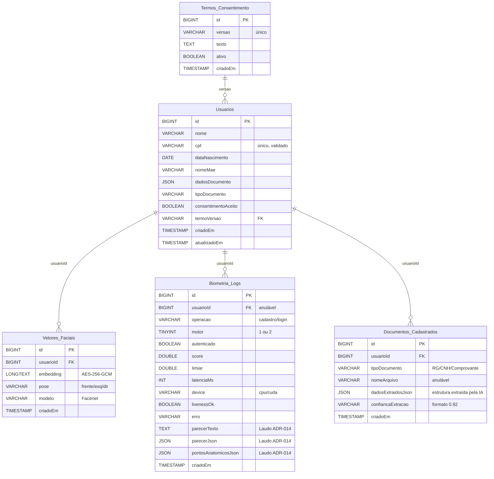

# Banco de Dados

Banco relacional **MySQL 8.0+** hospedado em VPS. Vetores faciais ficam em tabela própria, criptografados em nível de aplicação (AES-256 no C#, ADR-009).

> **Schema SQL executável:** [backend/Data/schema.sql](../backend/Data/schema.sql) — rode no MySQL para criar todas as tabelas. Decisão de SGBD registrada em [ADR-011](./decisoes.md).
>
> ORM: **Entity Framework Core** com **Pomelo Provider**.

## Diagrama de relacionamento (DER)



## Tabelas

### `Usuarios`
Armazena dados cadastrais e dados extraídos dos documentos.

| Coluna | Tipo | Notas |
|---|---|---|
| `id` | bigserial PK | |
| `nome` | varchar | extraído |
| `cpf` | varchar(14) único | validado em C# (dígitos) |
| `dataNascimento` | date | |
| `nomeMae` | varchar | |
| `dadosDocumento` | JSONB | campos extras por tipo de documento (endereço, RG, etc.) |
| `tipoDocumento` | varchar | RG / CNH / Comprovante |
| `consentimentoAceito` | bool | |
| `termoVersao` | varchar | FK lógica para `Termos_Consentimento` |
| `criadoEm` / `atualizadoEm` | timestamptz | |

### `Vetores_Faciais`
Uma linha por embedding (3 por usuário no cadastro). **Não** armazenar média (ADR-004).

| Coluna | Tipo | Notas |
|---|---|---|
| `id` | bigserial PK | |
| `usuarioId` | bigint FK → Usuarios | ON DELETE CASCADE |
| `embedding` | JSONB (criptografado) | array de floats; **criptografar em repouso** |
| `pose` | varchar | `frente` / `esquerda` / `direita` |
| `modelo` | varchar | ex.: `Facenet`, `VGG-Face` |
| `criadoEm` | timestamptz | |

### `Biometria_Logs`
Fonte das métricas de demonstração. `usuarioId` anulável para tentativas anônimas. Também é a fonte do Laudo Técnico (ADR-014).

| Coluna | Tipo | Notas |
|---|---|---|
| `id` | bigserial PK | |
| `usuarioId` | bigint FK, anulável | |
| `operacao` | varchar | `cadastro` / `login` |
| `motor` | smallint | 1 ou 2 |
| `autenticado` | bool | resultado da comparação |
| `score` | float | similaridade (0..1) |
| `limiar` | float | threshold aplicado |
| `latenciaMs` | int | tempo total da operação |
| `device` | varchar | `cpu` / `cuda` / `cloud` |
| `livenessOk` | bool | |
| `erro` | varchar, anulável | código de erro se houve |
| `parecerTexto` | TEXT, anulável | Laudo ADR-014 — parecer forense em linguagem natural (gerado pelo Motor 1) |
| `parecerJson` | JSON, anulável | Laudo ADR-014 — `{decisao, acaoRecomendada, similaridadePct, resumo, livenessAuditoria}` |
| `pontosAnatomicosJson` | JSON, anulável | Laudo ADR-014 — array com 5 pontos canônicos: `{item, status, observacao}` |
| `criadoEm` | timestamptz | |

### `Documentos_Cadastrados`
Armazena os documentos cadastrados pelo usuário e os dados extraídos via IA.

| Coluna | Tipo | Notas |
|---|---|---|
| `id` | bigserial PK | |
| `usuarioId` | bigint FK → Usuarios | ON DELETE CASCADE |
| `tipoDocumento` | varchar | RG / CNH / Comprovante |
| `nomeArquivo` | varchar, anulável | |
| `dadosExtraidosJson` | JSON | estrutura extraída pela IA |
| `confiancaExtracao` | varchar | formato 0.92 |
| `criadoEm` | timestamptz | |

### `Termos_Consentimento`
Histórico versionado dos termos exibidos no cadastro.

| Coluna | Tipo | Notas |
|---|---|---|
| `id` | bigserial PK | |
| `versao` | varchar único | ex.: `1.0` |
| `texto` | text | |
| `ativo` | bool | |

## Índices sugeridos

- `Usuarios(cpf)` único.
- `Vetores_Faciais(usuarioId)` — leitura por usuário no login.
- `Biometria_Logs(usuarioId, criadoEm)` e `Biometria_Logs(motor, criadoEm)` — relatórios de métricas.
- `Documentos_Cadastrados(usuarioId, tipoDocumento)` — consulta de documentos por usuário/tipo.

## Considerações de segurança

- Vetores faciais **criptografados em nível de aplicação** (AES-256 no C#, ADR-009) antes de gravar — independe do SGBD.
- MySQL oferece `AES_ENCRYPT`/`AES_DECRYPT` como camada adicional opcional (defesa em profundidade), mas **não substitui** a camada de aplicação.
- Acesso ao banco restrito por usuário/role; o backend usa uma role com privilégios mínimos.
- Backups também precisam ser criptografados (LGPD).
- **Nunca** gravar a foto bruta permanentemente; se necessário temporariamente, definir prazo curto de expurgo.

## Exemplo de JSON do embedding

```json
{
  "dim": 128,
  "valores": [0.0123, -0.0456, 0.0789, "..."]
}
```
O conteúdo é criptografado antes de persistir; a chave vive fora do banco (ver [lgpd-seguranca.md](./lgpd-seguranca.md)).
